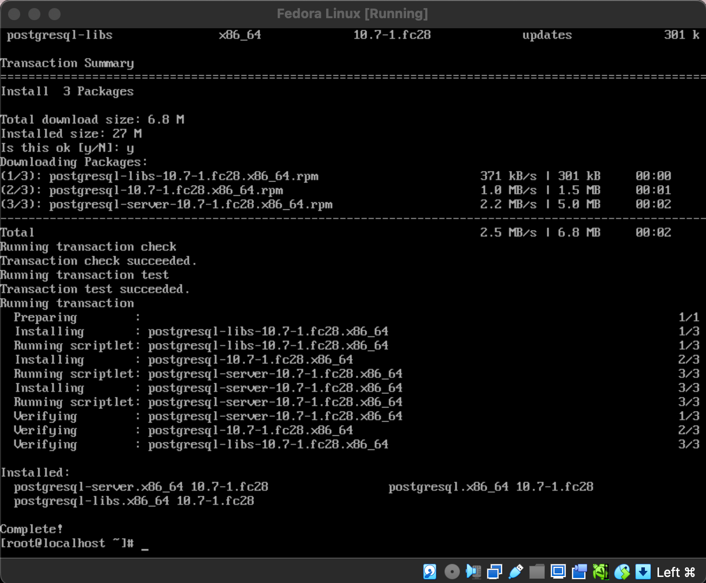
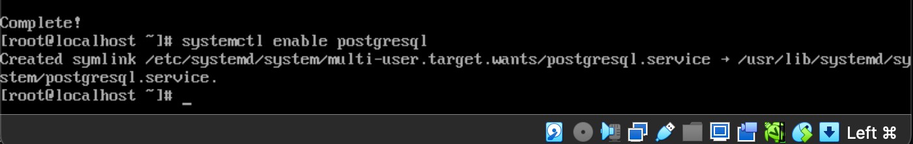
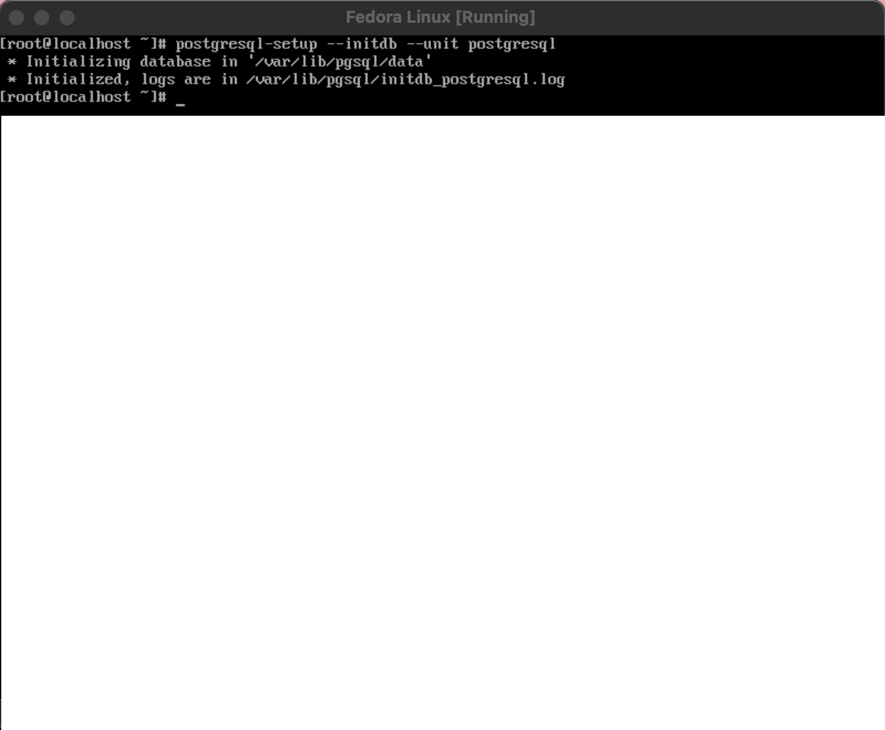
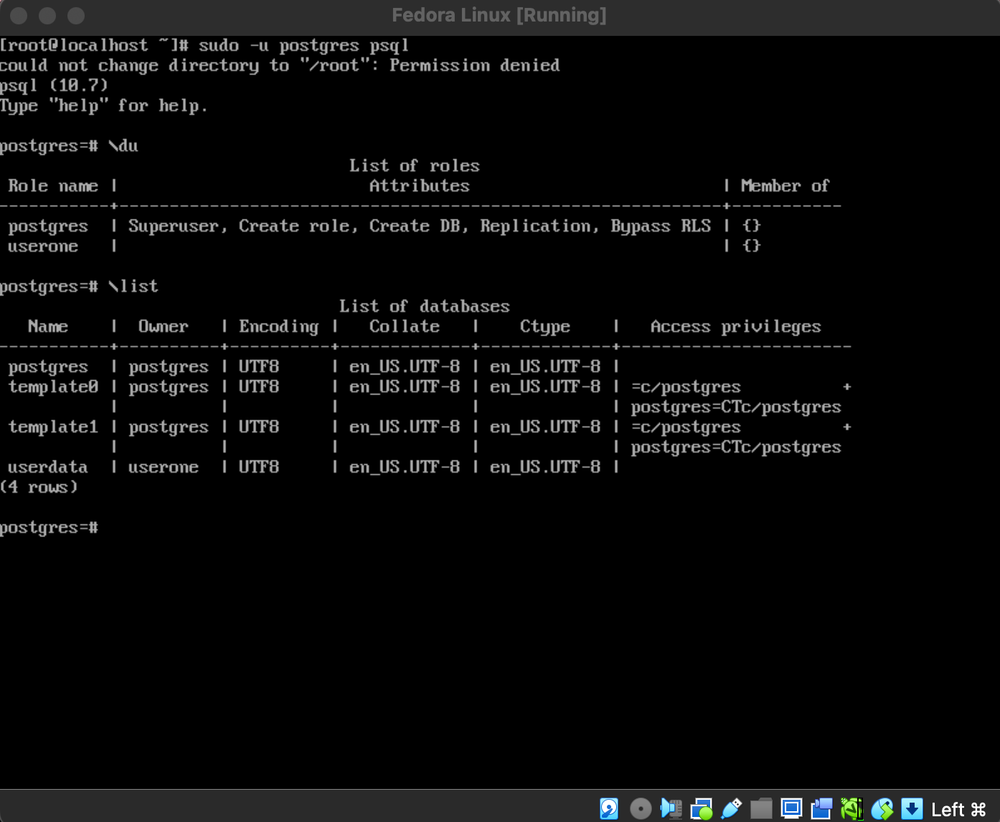
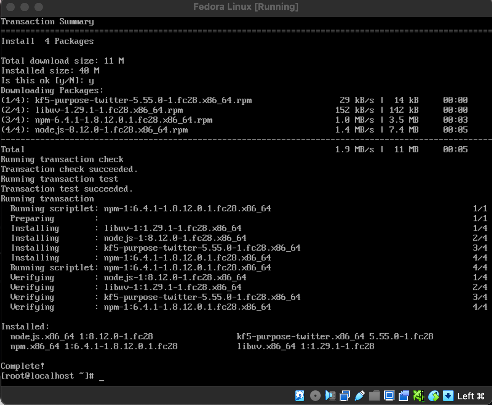
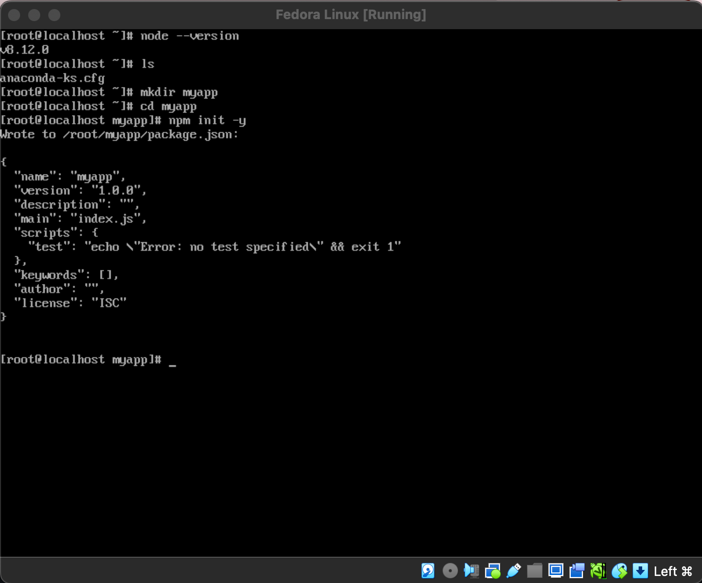
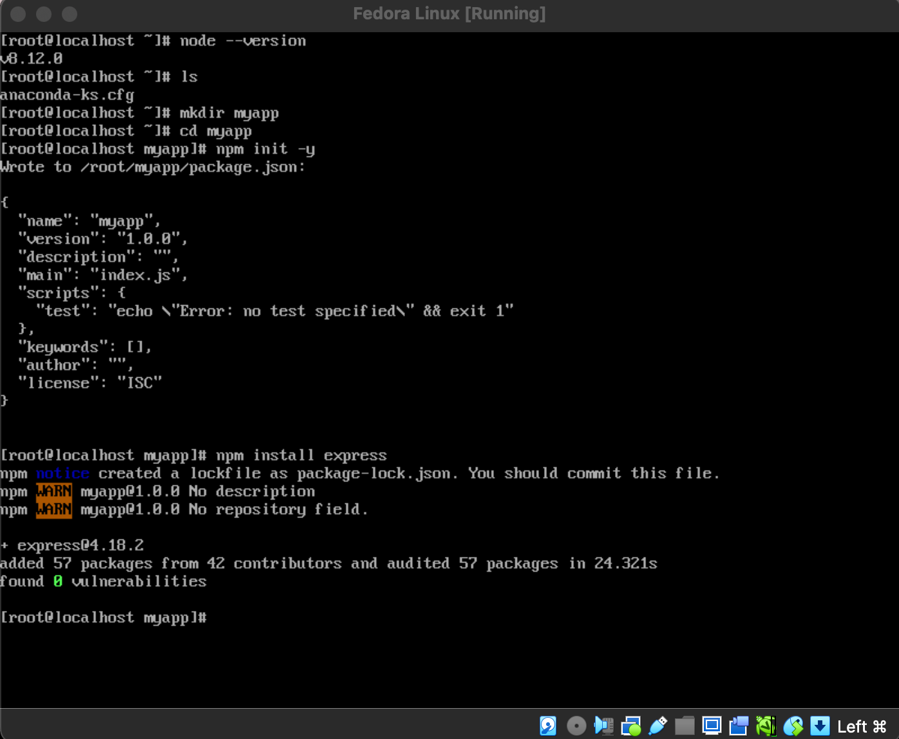
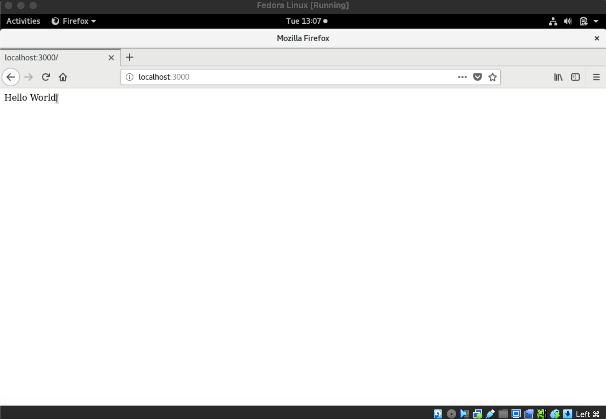

### CIT 352 FINAL PROJECT

**Demonstration on How to Set Up a PERN Stack that can be Used as a Web Server**

PERN stands for PostgreSQL, Express, React and Node.js. 

**PERN Requirements**
- PostgreSQL must be installed and start on boot of the OS
- Node.js must be installed and start on boot of the OS
- Express must be installed and serve a basic web page
- React is optional, but can be considered a stretch challenge
- The web server and PostgreSQL must start automatically when the OS starts

**STEP 1**: Install Postgresql. Use dnf and when prompted, enter "y"
```
dnf install postgresql-server
```


**Step 2**: How to set PostgreSQL to Start at Boot Time
```
systmectl enable postgresql
```


Step 3: Setting up Database

```
postgresql-setup --initdb --unit postgresql
```



Step 4: Starting up PostgreSQL Manually:

```
systemctl start postgresql
```
Step 5: Creating a PostgreSQL User and Database

```
sudo -u postgres psql
```
When in the postgresql command prompt, you can create a user and database by using the following command:

```
CREATE USER <username> WITH PASSWORD '<password>';
CREATE DATABASE <databaseName> OWNER <username>;
```
Check if the database and user were added

```
\du
\list
```
Step 6: After all is done, you can exit the terminal by:

```
\q
```


Access you user's database:

```
psql <databaseName>
```
**Node.js Installation**

Step 1: How to install Node.js. Use dnf and when prompted, enter "y"

```
dnf install nodejs
```


Express Installation and Web Server Setup

Step 1: Create a Directory

```
mkdir <directoryname>
cd <directoryname>
```

Step 2: Make a package.json file.

```
npm init -y
```


Step 3: Now Install Express

```
npm install express
```


Step 4: Making a js file.
```
vi app.js
```
Insert the following code below into the app.js file.

```
const express = require('express');
const bodyParser = require('body-parser');
const port = 3000;

const app = express();
app.use(bodyParser.json());
app.use(
  bodyParser.urlencoded({
    extended: true,
  })
);
```

Step 7: Verify your entry at "http://localhost:3000":


